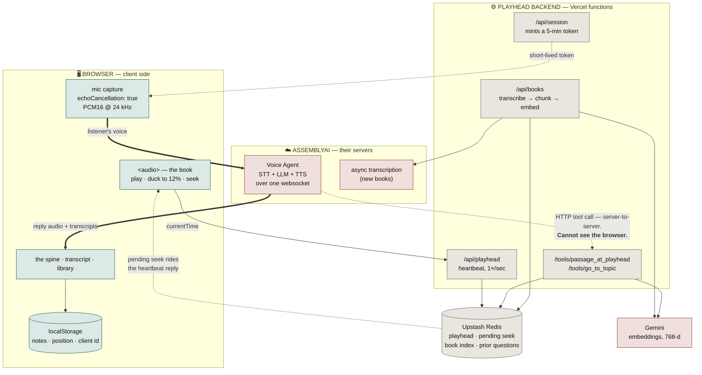

# Playhead

**An audiobook you can interrupt.** Say *"wait, what did that last part mean?"*
and it answers about the passage you just heard — then picks up where it left off.

**Live: https://playhead-app.vercel.app** — press start, let it play, talk over it.

Built for the AssemblyAI Voice Agent Hackathon.

> The name is the idea. In every other system the query is what you typed; here
> the query is **where you are**. The playhead is the question.

---

## The problem this solves

An audiobook is the one teacher you cannot raise your hand at. For people who
learn by ear — commuters, people with dyslexia or low vision, anyone whose
reading time is walking time — a sentence that doesn't land is simply lost. You
can rewind, but rewinding replays the same words that already failed.

Asking is the natural repair, and it has never been available.

## Why this is hard, and what's actually new here

Ask a normal retrieval system *"what did that mean?"* and it has nothing to work
with. **The question contains no topic.** There is no phrase to search for, no
entity to match, no keyword to embed. Every naive RAG pipeline answers this
question badly, because the thing being asked about is not in the question.

Playhead retrieves by **position, not by words**. The listener's playhead — where
they are in the audio — is the query. The passage they just heard is the answer's
context, whether or not they managed to name it.

We call this **position-first (deictic) retrieval**. "That", "this", "the last
bit", "he" — the words linguists call deictic, which point at context rather than
carry it — are exactly the words people use when something doesn't land. They are
the words search is worst at and position is best at.

Two rules fall out of it:

- **The playhead is the query.** A window of **−90 s / +15 s** around the
  listener's position, so it covers the run-up as well as the sentence itself.
- **Nothing after the playhead exists.** Semantic lookback is capped at the
  listener's position. Answering a chapter 3 question with chapter 12 material
  would spoil the book — a real failure, not a rounding error.

`compare_rag.py` runs the two approaches side by side on the same questions.

## Bring your own audiobook

The shipped Einstein chapter is a demo, not the product. Paste a direct link to
any audio file — or drop a short one in — and Playhead builds it the same index
it uses for its own book:

```
your link -> AssemblyAI transcription -> chunks cut at the reader's own pauses
          -> Gemini embeddings, 768-d, stored against each chunk's timestamp
          -> both tools work on it, spoiler cap included
```

Anything on [LibriVox](https://librivox.org) or archive.org works: open a chapter
and copy the direct MP3 link. A 17-minute chapter takes about two and a half
minutes to transcribe and index.

Two details worth knowing:

- **Indexing is driven by polling, not a worker.** A serverless function is
  killed at ten seconds and transcribing a book takes minutes, so each poll from
  the browser advances the job one bounded step — check the transcript, or embed
  the next hundred chunks — and writes down where it got to. That is also where
  the progress percentage comes from, instead of a spinner that means nothing.
- **Uploads stop at 4 MB, links do not.** The platform caps a request body, so
  the upload path is for a chapter or an episode. The page checks the size before
  sending and points you at the link form, rather than failing at the edge.

A user book is held in Redis rather than SQLite — the filesystem on a lambda is
read-only, and the request that builds an index is not the request that reads it.
`RedisLibrary` exposes the same `window` / `search` surface as the shipped
`Library`, so neither tool ever learns which kind of book it is holding.

## Architecture

Where each piece runs, and why the split is shaped this way:



**The seam this is all built around:** the agent runs on AssemblyAI's servers
and calls our tool over plain HTTP. It cannot see the page, so it has no idea
where playback is — and the page cannot be reached by the agent, so a jump
cannot be pushed to it. Both directions go through Redis: the browser writes
its position once a second, the tool reads it there, and `go_to_topic` leaves a
position behind that the next heartbeat reply collects. That is what makes a
*position-first* agent possible on a serverless deployment at all.

Three more things worth noting:

- **The backend holds no websocket.** The browser connects straight to
  AssemblyAI with a five-minute token this server mints, so the API key never
  reaches the client and the server stays stateless enough for serverless.
- **The agent lives on AssemblyAI's side** as a stored agent, with one HTTP
  tool. The client sends only an agent id — no prompt, no tool definitions.
- **The playhead travels out of band.** AssemblyAI calls the tool from its own
  servers and has no idea where playback is, so the browser reports position to
  Redis, and the tool reads it there. This is the seam that makes a
  *position-first* agent possible on a serverless deployment.

**Echo cancellation is why this is a browser app.** The book and the agent's own
voice come out of the speakers and back into the mic; the browser's native AEC
removes them, which a plain desktop capture cannot do.

## Stack

| Part | Choice |
|---|---|
| Voice agent (STT + LLM + TTS) | **AssemblyAI Voice Agent API**, one websocket, 24 kHz PCM16 both ways |
| Building the index | **AssemblyAI async transcription** (`universal-3-5-pro`), paragraph chunks with timestamps |
| Retrieval | SQLite time window + brute-force cosine over Gemini embeddings |
| Backend | FastAPI on Vercel |
| Shared state | Upstash Redis (memory fallback for local runs) |

**No vector database.** Brute-force cosine over a 10-hour book takes **1.3 ms**,
against ~2200 ms for the model call it feeds. A vector DB would have added
~200 MB of dependencies to save nothing measurable.

## Measured

- Einstein chapter: **20.6 min → 23 chunks**, median 50 s / 630 chars
- Brute-force cosine: **1.3 ms** for 1800 chunks × 3072-d
- Demo book: LibriVox *Relativity: The Special and General Theory*, §7–9 — public domain

## Run it locally

```bash
python -m venv .venv && .venv/Scripts/activate      # Windows
pip install -r requirements-dev.txt
cp .env.example .env                                 # add your keys

python scripts/create_agent.py https://your-public-url    # publish the agent
uvicorn server.main:app --reload
```

The tool URL must be publicly reachable — AssemblyAI calls it from its own
servers, so for local development use a tunnel (ngrok, cloudflared), not
localhost. `GET /api/health` reports whether the agent is configured and which
store is in use.

### Settings

| Variable | Default | What it does |
|---|---|---|
| `ASSEMBLYAI_API_KEY` | — | Required. STT, TTS, the agent, and transcription |
| `GEMINI_API_KEY` | — | Embeddings. Without it, position retrieval still works; topic search does not |
| `PLAYHEAD_AGENT_ID` | — | The stored agent, from `scripts/create_agent.py` |
| `PLAYHEAD_BOOK` | `relativity` | Which baked-in index to ship as the default book |
| `PLAYHEAD_MAX_UPLOAD_MB` | `4` | Ceiling on a direct file upload |
| `PLAYHEAD_MAX_SOURCE_MB` | `150` | Ceiling on a book fetched from a link |
| `UPSTASH_REDIS_REST_URL` / `_TOKEN` | — | Shared state. Without them it falls back to process memory, which is correct locally and **wrong on serverless** |

The two size ceilings are settings rather than constants so a different host can
raise them without touching code. One caveat on `PLAYHEAD_MAX_UPLOAD_MB`: it is
only ours down to whatever the platform enforces. Vercel rejects a request body
over ~4.5 MB at the edge, before any of this code runs, so raising it past that
only helps somewhere without that cap. Links have no such ceiling, which is why
they are the main path for a full-length book.

To index a different book, use the Library panel in the page — or, to bake one
into the repo the way the shipped book is:

```bash
python build_index.py path/to/book.mp3     # transcribe + chunk + embed to data/
python compare_rag.py                      # position-first vs naive RAG
python test_books.py                       # the user-book path, no keys required
```

## Layout

| Path | What it is |
|---|---|
| `web/`, `public/` | The browser client. **`public/` is what deploys** — copy `web/` into it |
| `server/main.py` | FastAPI: session tokens, playhead, the books API, the HTTP tools |
| `server/books.py` | Bring-your-own-book: transcribe → chunk → embed → `RedisLibrary` |
| `server/store.py` | Shared state: playhead, pending seek, prior context, book indexes |
| `server/agent.json` | The stored agent: system prompt + the two tools |
| `playhead/library.py` | The retrieval core — time window, capped semantic search |
| `build_index.py` | Offline version of the same pipeline, for the shipped book |
| `compare_rag.py` | Side-by-side: naive vector RAG vs position-first |
| `test_books.py` | Runs the user-book path against a stand-in Upstash. No keys needed |

## How we got here

Playhead began as a desktop app with local voice-activity detection, streaming
STT, and a separate TTS vendor. That version worked, and the tuning taught us
things worth keeping: speech reads at 0.024 RMS against room tone at 0.0002;
local barge-in detection beat a network round trip ~50 ms to ~300 ms; a
mid-question pause splits into two turns unless you stitch them.

It was retired when AssemblyAI's Voice Agent API collapsed that entire pipeline
into one websocket — and, more importantly, when a browser could do the echo
cancellation that the desktop build kept fighting. The retrieval core survived
the rewrite unchanged, which is the part that was ever novel.

## Licence

MIT — see [LICENSE](LICENSE).
